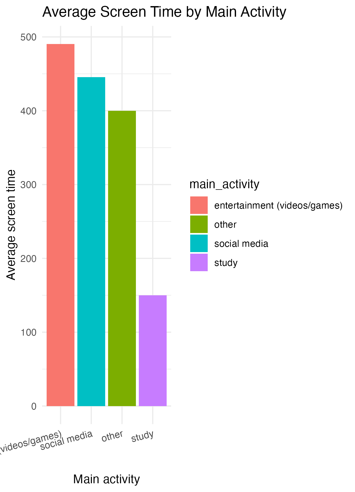
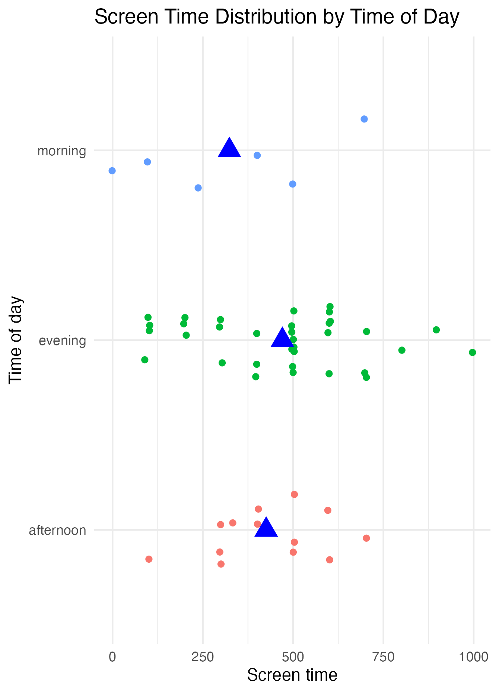
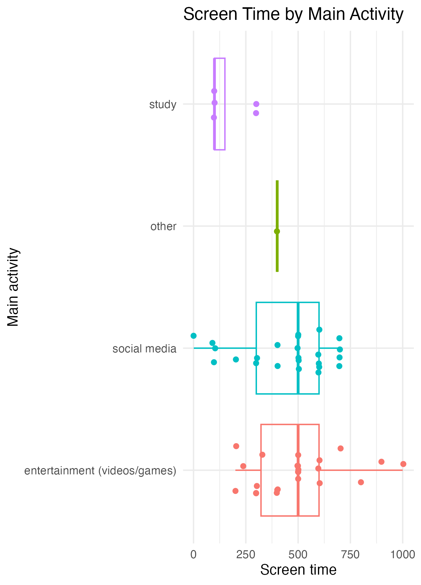
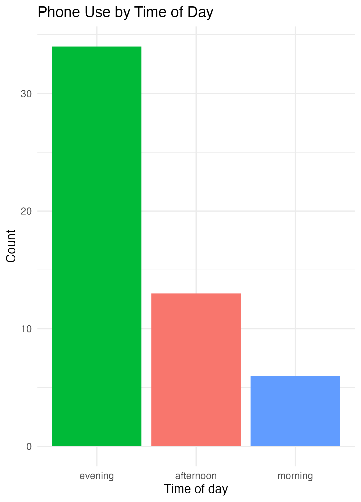

<script src="https://code.jquery.com/jquery-3.7.1.min.js" integrity="sha256-/JqT3SQfawRcv/BIHPThkBvs0OEvtFFmqPF/lYI/Cxo=" crossorigin="anonymous"></script>

```{r setup, include=FALSE}
knitr::opts_chunk$set(echo=FALSE, message=FALSE, warning=FALSE, error=FALSE)
```

```{js}
$(function() {
  $(".level2").css('visibility', 'hidden');
  $(".level2").first().css('visibility', 'visible');
  $(".container-fluid").height($(".container-fluid").height() + 300);
  $(window).on('scroll', function() {
    $('h2').each(function() {
      var h2Top = $(this).offset().top - $(window).scrollTop();
      var windowHeight = $(window).height();
      if (h2Top >= 0 && h2Top <= windowHeight / 2) {
        $(this).parent('div').css('visibility', 'visible');
      } else if (h2Top > windowHeight / 2) {
        $(this).parent('div').css('visibility', 'hidden');
      }
    });
  });
})
```
```{css echo=FALSE}
body {
  background-color: #f5f7fa;
  font-family: "Helvetica";
}

h1 {
  color: #1b4965;
  text-align: center;
}

h2 {
  color: #5fa8d3;
  border-bottom: 2px solid #5fa8d3;
  padding-bottom: 5px;
}

p {
  font-size: 16px;
  line-height: 1.6;
}

img {
  border-radius: 12px;
}
```

## Introduction

This visual data story explores my phone usage habits using observational logging data. The data records screen time, purpose of phone use, main activities, and time of day.



## Purposeful Phone Use

This visualisation compares average screen time between purposeful and non-purposeful phone use.



## Screen Time Across the Day

This visualisation uses timestamp information to compare screen time across different logged times.



## Main Phone Activities

This visualisation compares screen time distributions across different phone activities.



## Frequency of Phone Use

This visualisation shows the number of observations collected during different times of day.

## Conclusion

Overall, this visual story suggests that my screen time behaviour changes depending on time of day, purpose, and activity type.


## What's going on with this data?


## Wait, another dancing cat?


## A dance team of kittens!


